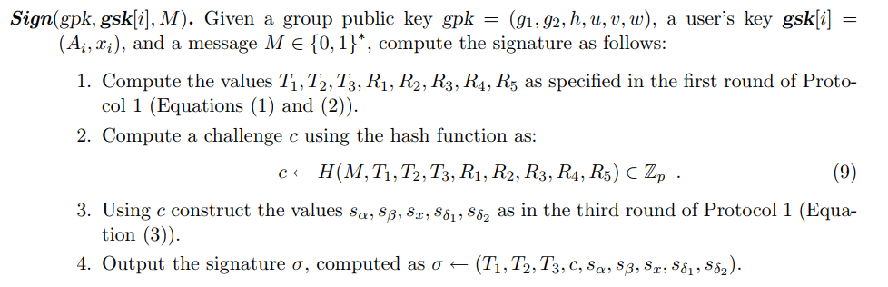

# 群签名和Go语言实现细节(BBS04--Short Group Signatures)

本文主要介绍论文《Short Group Signatures》群签名的go语言版本的具体实现。

本文是在参考 [yunfeiyanggzq](https://github.com/yunfeiyanggzq) 的实现基础上，进行了进一步的改造加工，以此为基础进行的详细解释。其代码地址为：

- https://github.com/yunfeiyangbuaa/BBS04_signature

## 群签名

在一个群签名方案中，一个群体中的任意一个成员可以以匿名的方式代表整个群体对消息进行签名。与其他数字签名一样，群签名是可以公开验证的，而且可以只用单个群公钥来验证。

群签名主要流程：

| 流程           | 解释                                                         |
| -------------- | ------------------------------------------------------------ |
| 生成群         | 生成群公钥(gpk)，群主私钥(gmsk)和群参数                      |
| 加入群         | 群主为群成员产生私钥(gsk)和证书(cert)                        |
| 生成群签名     | 群成员用私钥和证书产生群签名                                 |
| 群签名验证     | 其他人通过群公钥、群参数验证群签名信息的有效性（此时其他人仅知道签名者属于哪个群，但无法获取签名者身份信息） |
| 追踪签名者信息 | 在监管介入场景中，群主通过签名信息可获取签名者证书，从而追踪到签名者身份 |

## PBC库

首先，需要安装` GMP`库和`PBC`库，这些都是加密库，由C语言写的，官网地址为：[PBC Library](https://crypto.stanford.edu/pbc/)

安装方式可以参考上文中的[github地址](https://github.com/yunfeiyangbuaa/BBS04_signature)，也可以参考如下的方式安装：

### 安装 `GMP`

很多系统都有自带的安装包，在 `Debian / Ubuntu` 系统中，我们可以这样安装 :

```shell
sudo apt-get install libgmp-dev
```

### 安装 `PBC`库

##### 环境和编译

为了安装 PBC 库，需要先安装3个环境：

```shell
gcc
flex (http://flex.sourceforge.net/)
bison (https://www.gnu.org/software/bison/).
```

大多数的发行版本都包含了这3个库文件：

```shell
sudo apt-get install build-essential flex bison
```

然后，从 [PBC官网](https://crypto.stanford.edu/pbc/download.html) 下载安装包（如`pbc-0.5.14.tar.gz`）并解压。

```bash
$ tar -xzvf pbc-0.5.14.tar.gz
$ cd /pbc
$ ./configure
$ make
$ make install
```

##### 管理库路径

添加 pbc 库文件`libpbc.so.1`路径。

```bash
$ cd /etc/ld.so.conf.d
$ sudo vim libpbc.conf
```

在`/etc/ld.so.conf.d`路径下新建`libpbc.conf`文件，内容为：

```
/usr/local/lib
```

更新cache:

```bash
sudo ldconfig
```

### 常用的库函数

#### Add

```go
func (el *Element) Add(x, y *Element) *Element
```

说明：两数相加，Add sets el = x + y and returns el.

#### Invert

```go
func (el *Element) Invert(x *Element) *Element
```

说明：一个数的倒数，Invert sets el = 1/x and returns el.

#### Mul

```go
func (el *Element) Mul(x, y *Element) *Element
```

说明：两数相乘，Mul sets el = x * y and returns el. 

#### PowZn

```go
func (el *Element) PowZn(x, i *Element) *Element
```

说明：x的 i 次方，PowZn sets el = x^i and returns el. 

#### Neg

```go
func (el *Element) Neg(x *Element) *Element
```

说明：一个数的负数，Neg sets el = -x and returns el.

#### Pair

```go
func (el *Element) Pair(x, y *Element) *Element
```

说明：两个数的配对操作，Pair sets el = e(x,y) where e denotes the pairing operation, and returns el.

## Go语言实现

需要实现四个函数功能：

- $KeyGen(n)$
- $Sign(gpk, gsk[i], M)  $

- $Verify(gpk,M,σ)$
- $Open(gpk, gmsk, M, σ)  $

其中，参数解释：

-  $gpk$    表示的是群公钥，有：$gpk = (g_1, g_2, h, u, v, w)$
- $gsk[i]$ 表示的是群成员的私钥，有：$gsk[i] = (A_i, x_i)  $

- $M$ 表示的是需要签名的数据
- $σ$ 表示签名后的数据，有：$σ ← (T_1, T_2, T_3, c, s_α, s_β, s_x, s_{δ1}, s_{δ2})  $

- $gmsk$ 是群主持有的一对参数，用于揭示签名的主人，有： $gmsk = (ξ1, ξ2)  $

那么，具体如何实现呢？

我们使用Go语言实现，幸运的是，PBC有Go语言的库，官网地址为 [pbc · pkg.go.dev](https://pkg.go.dev/github.com/Nik-U/pbc)

### $KeyGen(n)$

我们先看一下该函数如何实现：


由论文可知：

#### 产生群公钥

需要先选择两个参数：$g_1, g_2$ ：

```go
params:=pbc.GenerateA(160,512)
pairing:=params.NewPairing()
g1:=pairing.NewG1().Rand()
g2:=pairing.NewG2().Rand()
```

之后，根据运算规则，先定义公钥和群私钥的结构体：

```go
// 群公钥
type Group struct {
	g1, g2, h, u, v, w  *pbc.Element
	pairing             *pbc.Pairing
}

// 群主的私钥
type PrivateKey struct {
	*Group
	xi1, xi2, gamma *pbc.Element
}
```

其中，群私钥`PrivateKey`里的成员，有：

- $(xi1, xi2) = (ξ_1, ξ_2)$

- $gamma = γ  $

实现各个参数：

```go
priv.gamma = priv.pairing.NewZr().Rand()
priv.xi1 = priv.pairing.NewZr().Rand()
priv.xi2 = priv.pairing.NewZr().Rand()
```

之后，参数`h` 为：

```go
priv.h = priv.pairing.NewG1().Rand()
```

参数 `u, v` 为：

```go
temp1 := priv.pairing.NewZr().Invert(priv.xi1)      // Invert sets el = 1/x and returns el.
temp2 := priv.pairing.NewZr().Invert(priv.xi2)
priv.u = priv.pairing.NewG1().PowZn(priv.h, temp1)  // PowZn sets el = x^i and returns el. 
priv.v = priv.pairing.NewG1().PowZn(priv.h, temp2)
```

参数`W` 为：

```go
priv.w = priv.pairing.NewG2().PowZn(priv.g2, priv.gamma)
```

组合起来，即实现了群主私钥和群公钥：

- 群公钥`Group`：$gpk = (g_1, g_2, h, u, v, w)$

- 群主私钥`PrivateKey`:   $(γ,ξ1, ξ2,gpk)$

#### 产生群成员私钥

我们知道，群成员的私钥是：$gsk[i] = (A_i, x_i)  $，其中：

- $x_i ← Z^∗_p  $

- $A_i ← g_1^{1/(γ+x_i)} ∈ G1  $

所以，有：

```go
// 群成员的私钥,群成员的私钥中，有保护群公钥
type Cert struct {
	*Group                // 群公钥
	A, a *pbc.Element     // A_i, x_i
}
```

解释：

$(A_i, x_i) = (A, a *pbc.Element)$

则，代码有：

```go
cert := new(Cert)
cert.Group = priv.Group
cert.a = priv.pairing.NewZr().Rand()   // 产设X_i
 
temp3 := priv.pairing.NewZr().Add(priv.gamma, cert.a)   // Add sets el = x + y and returns el.
temp4 := priv.pairing.NewZr().Invert(temp3)
cert.A = priv.pairing.NewG1().PowZn(priv.g1, temp4)     // 产设A_i
```

至此，产生了群成员的私钥

### $Sign(gpk, gsk[i], M)$

我们先看一下该函数如何实现：



#### 签名结构体

由论文，我们先定义一个结构体：

```go
// 签名
type Sig struct {
	m                                                  string
	t1, t2, t3, c, salpha, sbeta, sa, sdelta1, sdelta2 *pbc.Element
}
```

其中，由：

- $m$ 表示需要签名的信息
- $t1, t2, t3$  表示： $T_1, T_2, T_3$

- $salpha, sbeta$ 表示：$s_α, s_β$
- $ sdelta1, sdelta2$ 表示: $s_{δ1}, s_{δ2}$

- $sa$ 表示：$s_x$

- $c$ 表示：$c$

之后，根据论文，开整。

这些参数怎么计算呢？论文给出了计算公式：


根据这些公式实现即可：

根据公式：$α, β \leftarrow Z_{p}^{*}$，有：

```go
alpha := cert.pairing.NewZr().Rand()
beta := cert.pairing.NewZr().Rand()
```

#### 计算 $T_1, T_2, T_3$

根据`公式(1)` ，计算 $T_1, T_2, T_3$， 有：

```go
t1 := cert.pairing.NewG1().PowZn(cert.u, alpha)
t2 := cert.pairing.NewG1().PowZn(cert.v, beta)
tmp := cert.pairing.NewZr().Add(alpha, beta)
tmp1 := cert.pairing.NewG1().PowZn(cert.h, tmp)
t3 := cert.pairing.NewG1().Mul(cert.A, tmp1) 
```

计算两个辅助值：$δ_1 \leftarrow xα , δ_2 \leftarrow xβ \in Z_{p}^{*}.  $

```go
delta1 := cert.pairing.NewZr().Mul(cert.a, alpha)
delta2 := cert.pairing.NewZr().Mul(cert.a, beta)
```

其中，`cert.a`表示群成员私钥 $gsk[i] = (A_i, x_i)$ 中的 $x_i$

#### 计算$\{R_1, R_2, R_3,R_4,R_5\}$

Alice挑选参数：$r_α,r_β, r_x, r_{δ_1}, \; and \; r_{δ_2}  $

```go
ralpha := cert.pairing.NewZr().Rand()       // r_α
rbeta := cert.pairing.NewZr().Rand()        // r_β
rdelta1 := cert.pairing.NewZr().Rand()      // r_{δ_1}
rdelta2 := cert.pairing.NewZr().Rand()      // r_{δ_2}
ra := cert.pairing.NewZr().Rand()           // r_x
```

接下来，根据`公式(2)` ，计算 $\{R_1, R_2, R_3,R_4,R_5\}$， 有：：

```go
	r1 := cert.pairing.NewG1().PowZn(cert.u, ralpha)    // 幂指数
//**********************************************************//
	r2 := cert.pairing.NewG1().PowZn(cert.v, rbeta)
//**********************************************************//  分别对应论文中的各个参数
	temp1 := cert.pairing.NewGT().Pair(t3, cert.g2)
	r3_e1 := cert.pairing.NewGT().PowZn(temp1, ra)
	uuu := cert.pairing.NewZr().Neg(ralpha)                // Neg sets el = -x and returns el.
	www := cert.pairing.NewZr().Neg(rbeta)
	xxx := cert.pairing.NewZr().Add(uuu, www)              // Add sets el = x + y and returns el. 
	r3_e2 := cert.pairing.NewGT().PowZn(cert.ehw, xxx)
	uuu1 := cert.pairing.NewZr().Neg(rdelta1)
	www1 := cert.pairing.NewZr().Neg(rdelta2)
	xxx1 := cert.pairing.NewZr().Add(uuu1, www1)
	r3_e3 := cert.pairing.NewGT().PowZn(cert.ehg2, xxx1)
	r3 := cert.pairing.NewGT().Mul(cert.pairing.NewGT().Mul(r3_e1, r3_e2), r3_e3)
//**********************************************************//
	tt_temp2 := cert.pairing.NewG1().PowZn(t1, ra)
	tt_temp := cert.pairing.NewZr().Neg(rdelta1)
	tt := cert.pairing.NewG1().PowZn(cert.u, tt_temp)
	r4 := cert.pairing.NewG1().Mul(tt, tt_temp2)            // Mul sets el = x * y and returns el.
//**********************************************************//
	rr_temp2 := cert.pairing.NewG1().PowZn(t2, ra)
	rr_temp := cert.pairing.NewZr().Neg(rdelta2)
	rr := cert.pairing.NewG1().PowZn(cert.v, rr_temp)
	r5 := cert.pairing.NewG1().Mul(rr, rr_temp2)
```

#### 计算挑战`c`

根据公式：
$$
c \leftarrow H(M, T_1, T_2, T_3, R_1, R_2, R_3, R_4, R_5) \in Z_p^*
$$
代码实现为：

```go
	var s string
	s += t1.String()
	s += t2.String()
	s += t3.String()
	s += r1.String()
	s += r2.String()
	s += r3.String()
	s += r4.String()
	s += r5.String()
	s += m
	c := cert.pairing.NewZr().SetFromStringHash(s, sha256.New())
```

#### 计算$\{s_α, s_β, s_x, s_{δ_1}, s_{δ_2}\}$

根据公式(3)，计算 $\{s_α, s_β, s_x, s_{δ_1}, s_{δ_2}\}$ 

```go
	sig.salpha = cert.pairing.NewZr().Add(ralpha, cert.pairing.NewZr().Mul(c, alpha))
	sig.sbeta = cert.pairing.NewZr().Add(rbeta, cert.pairing.NewZr().Mul(c, beta))
	sig.sa = cert.pairing.NewZr().Add(ra, cert.pairing.NewZr().Mul(c, cert.a))
	sig.sdelta1 = cert.pairing.NewZr().Add(rdelta1, cert.pairing.NewZr().Mul(c, delta1))
	sig.sdelta2 = cert.pairing.NewZr().Add(rdelta2, cert.pairing.NewZr().Mul(c, delta2))
```

#### 签名$σ$

根据公式，计算 $σ \leftarrow  (T_1, T_2, T_3, c, s_α, s_β, s_x, s_{δ_1}, s_{δ_2})  $

其实，在上面的实现中，我们已经计算出来了 $σ$ 。即，我们的结构体 `Sig` 就是  $σ$ 。

### $Verify(gpk, M, σ)  $

我们先看一下该函数如何实现：


也就是说，需要根据公式(10)，计算出$R_1, R_2,R_3,R_4,R_5$

计算规则为：

```go
	r1 := g.pairing.NewG1().Mul(g.pairing.NewG1().PowZn(g.u, sig.salpha), g.pairing.NewG1().PowZn(sig.t1, g.pairing.NewZr().Neg(sig.c)))
//**********************************************************//
	r2 := g.pairing.NewG1().Mul(g.pairing.NewG1().PowZn(g.v, sig.sbeta), g.pairing.NewG1().PowZn(sig.t2, g.pairing.NewZr().Neg(sig.c)))
//**********************************************************//
	temp1 := g.pairing.NewGT().Pair(sig.t3, g.g2)
	r3_e1 := g.pairing.NewGT().PowZn(temp1, sig.sa)
	uuu := g.pairing.NewZr().Neg(sig.salpha)
	www := g.pairing.NewZr().Neg(sig.sbeta)
	xxx := g.pairing.NewZr().Add(uuu, www)
	r3_e2 := g.pairing.NewGT().PowZn(g.ehw, xxx)
	uuu1 := g.pairing.NewZr().Neg(sig.sdelta1)
	www1 := g.pairing.NewZr().Neg(sig.sdelta2)
	xxx1 := g.pairing.NewZr().Add(uuu1, www1)
	r3_e3 := g.pairing.NewGT().PowZn(g.ehg2, xxx1)
	r3_tep := g.pairing.NewGT().Mul(g.pairing.NewGT().Mul(r3_e1, r3_e2), r3_e3)
	yyy := g.pairing.NewGT().Pair(sig.t3, g.w)
	ggg := g.pairing.NewGT().Pair(g.g1, g.g2)
	hhh := g.pairing.NewGT().Invert(ggg)
	r3 := g.pairing.NewGT().Mul(r3_tep, g.pairing.NewGT().PowZn(g.pairing.NewGT().Mul(yyy, hhh), sig.c))
//**********************************************************//
	tt_temp2 := g.pairing.NewG1().PowZn(sig.t1, sig.sa)
	tt_temp := g.pairing.NewZr().Neg(sig.sdelta1)
	tt := g.pairing.NewG1().PowZn(g.u, tt_temp)
	r4 := g.pairing.NewG1().Mul(tt, tt_temp2)
//**********************************************************//
	rr_temp2 := g.pairing.NewG1().PowZn(sig.t2, sig.sa)
	rr_temp := g.pairing.NewZr().Neg(sig.sdelta2)
	rr := g.pairing.NewG1().PowZn(g.v, rr_temp)
	r5 := g.pairing.NewG1().Mul(rr, rr_temp2)
```

再和`c`做对比：

```go
	var s string
	s += sig.t1.String()
	s += sig.t2.String()
	s += sig.t3.String()
	s += r1.String()
	s += r2.String()
	s += r3.String()
	s += r4.String()
	s += r5.String()
	s += sig.m

	c_ := g.pairing.NewZr().SetFromStringHash(s, sha256.New())
	if c_.Equals(sig.c) {
		fmt.Println("verify_sign   true")
		return true
	} else {
		fmt.Println("verify_sign   false")
		return false
	}
```

### $Open(gpk, gmsk, M, σ)$

我们来看看群主是怎么open追踪到是谁签名的：


群主有 $(ξ_1, ξ_2)$，需要计算：
$$
A_i \leftarrow T_3/(T_1^{ξ_1} \cdot T_2^{ξ_2})
$$
即：

```go
temp1 := priv.pairing.NewG1().PowZn(sig.t1, priv.xi1)
temp2 := priv.pairing.NewG1().PowZn(sig.t2, priv.xi2)
temp3 := priv.pairing.NewG1().Mul(sig.t3, priv.pairing.NewG1().Invert(priv.pairing.NewG1().Mul(temp1, temp2)))
fmt.Printf("%X\n", sha256.Sum256(temp3.Bytes()))
return temp3
```


